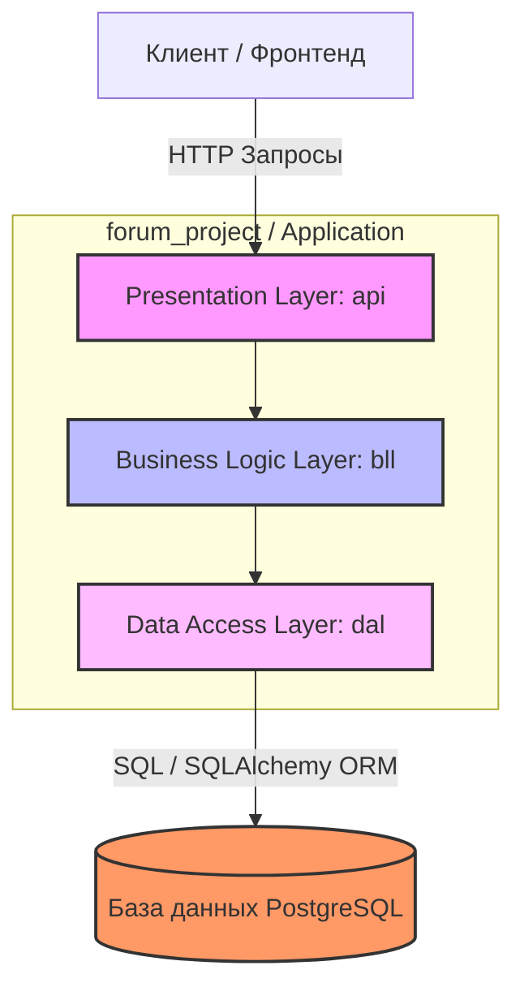

### Архитектурная диаграмма пакетов проекта (Многослойная архитектура)

```mermaid
flowchart TD
    subgraph forum_project [forum_project / Application]
        api[Presentation Layer: api]
        bll[Business Logic Layer: bll]
        dal[Data Access Layer: dal]
        
        api --> bll
        bll --> dal
    end

    db[(База данных PostgreSQL)]
    client[Клиент / Фронтенд]

    client --> |HTTP Запросы| api
    dal --> |SQL / SQLAlchemy ORM| db

    style api fill:#f9f,stroke:#333,stroke-width:2px
    style bll fill:#bbf,stroke:#333,stroke-width:2px
    style dal fill:#fbf,stroke:#333,stroke-width:2px
    style db fill:#f96,stroke:#333,stroke-width:2px
```
